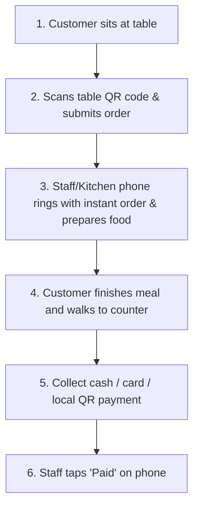

# QR Ordering with Counter Checkout: The Practical Guide for Small Restaurants

When exploring **QR code ordering**, many independent restaurant owners, cafe operators, and street food vendors share a common concern: *"If we let customers scan a QR code to place orders, do we have to integrate complex payment gateways, force customers to pay online immediately, or buy expensive POS terminals?"*

The short answer is: **No, not at all.**

The **"QR Ordering with Counter Checkout"** model is currently the most practical, cost-effective, and flexible solution for small and independent F&B businesses.

---

## 1. How Does This Workflow Work?

The day-to-day workflow in the restaurant is straightforward and seamless:

1. **Customer scans the table QR code**: The interactive digital menu opens directly in their mobile browser—no app downloads required.
2. **Customer selects items and places the order**: They can customize options (sizes, toppings, spice levels, dietary notes) and tap submit.
3. **Staff receives instant notifications on mobile phones**: Floor staff or kitchen crew receive the order details immediately on their smartphones to start food preparation.
4. **Customer finishes meal and walks to the counter**: The customer mentions their table number or staff brings the bill to the table.
5. **Collect payment using your existing methods**: Accept cash, swipe cards with existing standalone payment terminals, or show your standard bank transfer QR code.
6. **Staff confirms completion**: Staff opens their mobile screen, marks the order as "Paid", and the table is ready for the next guest.

---

## 2. Why Small Restaurants Choose QR Ordering + Counter Checkout

### Save 80% of Staff Ordering Time
During peak hours, having staff stand by tables waiting 5–10 minutes while customers decide creates a major bottleneck. With table QR ordering, guests browse vivid dish photos, discuss choices, and submit orders when ready.

### Keep 100% Cash Flow and No Payment Gateway Fees
You don't need to sign up for merchant payment gateways, wait days for settlements, or lose 1.5%–3% in transaction fees. Your money stays in your hands or goes directly into your bank account immediately.

### Zero Hardware or POS Investment
You and your staff only need standard smartphones. Everything from receiving incoming tickets to updating order statuses happens smoothly on mobile devices.

---

## 3. Comparison with Other Ordering Systems

| Criteria | Traditional Paper Menu | QR Ordering + Counter Checkout (TaoMenu) | Full POS + Mandatory Online Payment |
|---|---|---|---|
| **Upfront Hardware Cost** | Low (paper printing) | **$0 (use existing phones)** | High ($500–$2,000 for POS terminals, printers) |
| **Rush Hour Speed** | Slow, prone to order mistakes | **Fast, customers submit directly** | Fast, but checkout friction can slow queues |
| **Payment Gateway Fees** | 0% | **0% (direct collection)** | 1.5%–3% per transaction |
| **Price & Out-of-stock Updates** | Requires complete reprinting | **Instant update on mobile** | Requires POS configuration |
| **Best Suited For** | Very small stalls | **Independent diners, cafes, bakeries** | Large restaurant chains, franchises |

---

## 4. How to Launch in 10 Minutes

1. **Create an account & menu**: Sign up on [TaoMenu](https://taomenu.app), enter your items or snap a photo of your existing paper menu for AI import.
2. **Print table QR codes**: Download pre-numbered table QR sheets (Table 1, Table 2, etc.) and place them on tables or acrylic standees.
3. **Invite staff**: Team members open the management link on their phones to receive live order notifications.
4. **Start serving**: Guide guests to scan the QR code to order and pay at the counter after their meal.

---

## Conclusion

Modernizing your restaurant does not require buying expensive machines or adding payment complexity. Starting with **QR code ordering and counter checkout** is the smartest, most budget-friendly way to streamline service today.

👉 Learn more:
- [Mobile-First Restaurant Ordering Software](/phan-mem-order-tren-dien-thoai)
- [Create Free QR Menu for Restaurants](/menu-qr-cho-quan-an)
- [Pricing & Plans](/pricing)
