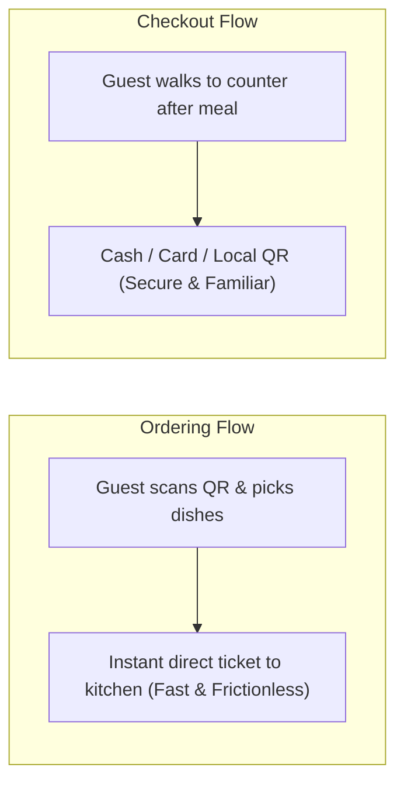

# Does QR Ordering Require Online Payment?

One of the most persistent misconceptions among restaurant operators is: *"Adopting QR code ordering means guests are forced to enter credit card details or use digital wallets online before getting their food."*

This assumption triggers immediate operational worries:
- Older guests or regular patrons prefer paying with physical cash.
- The business has to set up complex online merchant gateway contracts.
- Revenues are delayed in settlement escrow and burdened by 1.5% to 3% transaction cut fees.

The reality is: **Placing Orders (Ordering) and Collecting Money (Settlement) are two completely separate functions.** You can easily allow customers to order via QR while keeping traditional cash or counter payment.

---

## 1. Why Decoupling Ordering and Payment Works Better

By keeping these two processes distinct:

1. **Frictionless Ordering Speed**: Guests pick dishes and submit orders immediately without payment screen drop-offs or SMS OTP authentication delays.
2. **Effortless Order Adjustments**: If a guest wants to add extra drinks, change a side dish, or cancel an item, staff can adjust the running bill seamlessly without processing online credit card refunds.
3. **Save 100% on Third-Party Merchant Surcharges**: You avoid high credit card gateway fees and receive your money immediately without multi-day settlement delays.

---

## 2. Flexible Counter Settlement Options

With platforms like [TaoMenu](https://taomenu.app), once guests finish dining, staff can settle tabs using whichever payment channel your store prefers:

- **Cash**: Hand cash and change, then tap "Paid" on the staff phone.
- **Stand-alone Bank QR**: Display your local instant transfer QR code at the register.
- **Existing Card Terminals**: Swipe or tap credit/debit cards on your standalone countertop terminal.

---

## 3. When is Mandatory Online Payment Actually Useful?

Mandatory pre-paid digital ordering is typically only necessary for:
- **Self-service Food Courts**: Fast-casual venues where guests pick up trays without table service.
- **Delivery & Takeout Ahead**: Pre-orders to prevent customer no-shows.

For traditional dine-in restaurants, cafes, and casual eateries, combining **table QR ordering with counter checkout** provides the ideal balance of operational speed and customer convenience.

---

## Summary

You don't need complex online payment integrations or costly transaction fees to digitize ordering. Start using **table QR ordering** today to liberate staff from handwriting tickets while keeping your proven, secure cash management process.

👉 Learn more:
- [QR Ordering with Counter Checkout Guide](/blog/order-bang-qr-thanh-toan-tai-quay)
- [Smartphone-Based Restaurant Management](/phan-mem-order-tren-dien-thoai)
- [TaoMenu Pricing](/pricing)
