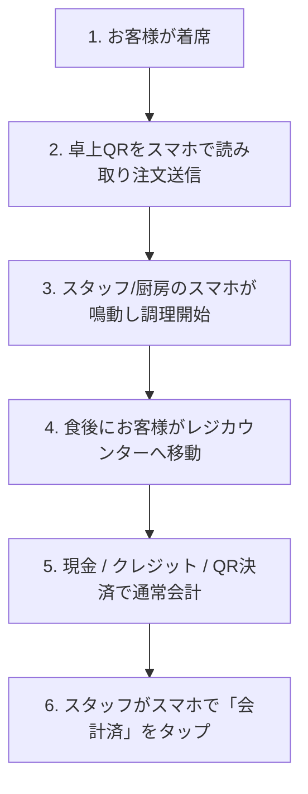

# QRコード注文とレジ会計：小規模飲食店の最適な運用ガイド

個人経営の飲食店やカフェ、軽食店で**QRコードによるテーブル注文（モバイルオーダー）**の導入を検討する際、多くのオーナー様が次のような疑問を抱かれます：
- *「QR注文を導入すると、お客様にその場でクレジットカード決済を強制しなければならないの？」*
- *「ご年配のお客様や常連さんの現金払いに対応できなくなるのでは？」*
- *「数十万円もする高額なタッチパネル式POSレジを買い直す必要があるの？」*

結論からお伝えすると、**その心配は一切不要です**。

**「QRコードでテーブル注文 ＋ 会計は従来の店頭レジ」**という運用モデルは、小規模な飲食店にとって最も手軽でコストがかからず、現場の負担を劇的に減らすベストな選択肢です。

---

## 1. 具体的な店舗オペレーションの流れ

店舗での日々の運用は非常にシンプルで直感的です：

1. **お客様が卓上QRを読み取り**：専用アプリのダウンロードは不要。スマホの標準カメラで読み取るだけでブラウザ上にメニューが表示されます。
2. **お客様自身でメニューを選んで注文**：トッピングや辛さ、サイズを選び、注文ボタンを押します。
3. **スタッフ・厨房のスマホに即時通知**：スタッフや料理人の手元のスマートフォンが鳴り、テーブル番号と注文内容（サイズや備考）が表示されます。
4. **お食事後にお客様がレジへ**：卓番号を伝えるか、スタッフが伝票を持ってテーブルへ向かいます。
5. **いつもの方法でお会計**：現金、店舗既存のカード端末、店舗のPayPay等のQRコードで通常通り精算します。
6. **スタッフがスマホで完了処理**：スタッフ管理画面で「会計済」をタップすればテーブルがリセットされ、次のお客様をお迎えできます。

---

## 2. 小規模店舗が「QR注文＋店頭会計」を選ぶメリット

### ピーク時の注文伺い時間を80%削減
忙しいランチタイムやディナー時に、スタッフがテーブル脇でお客様がメニューを決めるのを5〜10分間立ち止まって待つ必要がなくなります。お客様は写真を見ながらじっくり選び、決まり次第スマホから注文できます。

### 決済手数料ゼロ＆売上金が即時手元に
外部のオンライン決済代行会社と契約する必要がなく、売上保留期間や1.5%〜3%のオンライン決済手数料も発生しません。売上金は100%そのまま店舗に入ります。

### 専用POSレジや専用端末の購入費用が不要
オーナー様やスタッフが普段使っている個人のスマートフォンをそのまま管理端末として利用可能。重たいPOS専用機をカウンターに置く必要はありません。

---

## 3. 注文方式の比較

| 比較項目 | 従来の紙メニュー | QR注文＋レジ会計 (TaoMenu) | 大手POS専用機＋オンライン決済 |
|---|---|---|---|
| **初期ハードウェア費用** | 低（紙の印刷代） | **0円（手持ちのスマホを活用）** | 高額（数十万〜百万円） |
| **ピーク時の注文処理速度** | 遅い（聞き間違い・遅延） | **高速（お客様が直接送信）** | 高速（ただし決済で詰まる場合あり） |
| **決済代行手数料** | 0% | **0%（店頭で直接受け取り）** | 1.5%〜3%の決済手数料が発生 |
| **価格変更・品切れ設定** | 再印刷が必要 | **スマホから1秒で即時反映** | POS管理画面の複雑な設定が必要 |
| **最適な店舗規模** | ごく小規模な屋台 | **個人店、カフェ、街の食堂** | 大型チェーン、フランチャイズ |

---

## 4. わずか10分で店舗導入を完了するステップ

1. **アカウント登録とメニュー入力**：[TaoMenu](https://taomenu.app) に無料登録し、メニューを入力（または既存の紙メニューをスマホで撮影してAI自動取り込み）。
2. **テーブルQRコードの印刷**：テーブル番号付きのQRコードをA4用紙に印刷し、卓上スタンド等に設置。
3. **スタッフの参加**：スタッフがスマホから管理画面を開き、注文通知の受信をスタンバイ。
4. **営業スタート**：お客様にQRコード読み取りをご案内し、食後にレジでお会計。

---

## まとめ

飲食店のデジタル化は、高額な設備投資や複雑なシステム変更を伴う必要はありません。**「QRコード注文 ＋ 店頭レジ会計」**からスタートすることが、コストを抑えてスタッフの負担を減らす最も賢い選択です。

👉 関連リンク：
- [スマホで動く飲食店向け注文システム](/ja/phan-mem-order-tren-dien-thoai)
- [飲食店のQRメニュー無料作成方法](/ja/menu-qr-cho-quan-an)
- [料金プランと機能一覧](/ja/pricing)
