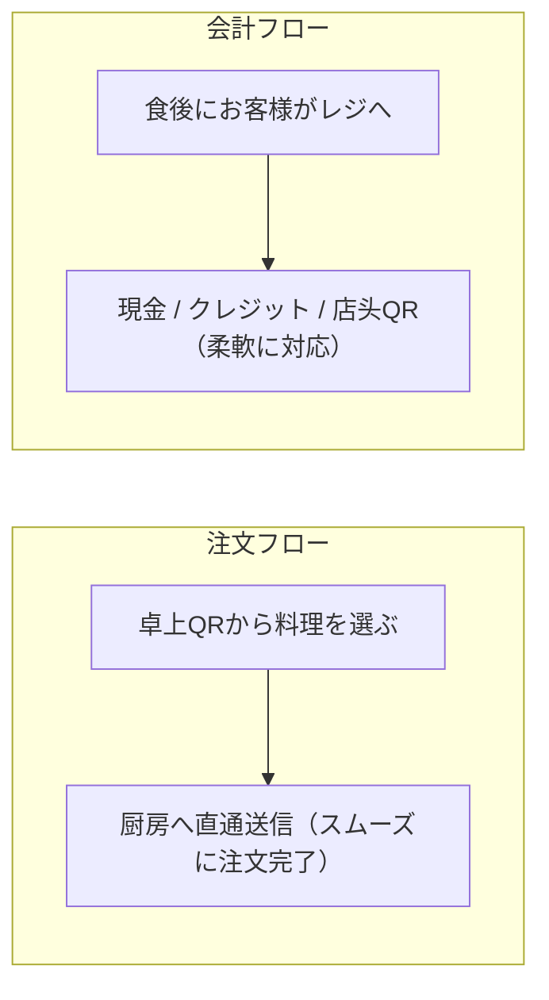

# QR注文にオンライン決済は必須？現地会計のメリットを解説

モバイルオーダーやQRコード注文を導入しようと検討する際、よくある思い込みの一つが：*「スマホで注文させるなら、クレジットカード番号を入力させたり、事前にオンライン決済させなければいけないのでは？」* というものです。

これによって、次のような懸念が生じます：
- 現金派のお客様やご年配の方が注文しづらくなる。
- 決済代行会社への審査手続きが煩雑。
- 売上ごとに1.5%〜3%以上のオンライン決済手数料が引かれ、入金まで数日待たされる。

実際には：**「注文（Ordering）」と「会計（Payment）」は完全に切り離して運用できます。**

お客様にはQRコードから自由に料理を選んで注文してもらい、お会計は従来通りのレジで対応するスタイルが、多くの飲食店にとって最もスムーズです。

---

## 1. 「注文」と「会計」を分離する3大メリット

注文と会計を切り離すことで：

1. **注文の離脱を防ぎ、注文速度を最大化**：クレジットカード情報の入力や認証コードの受信待ちがないため、お客様がストレスなくスムーズに注文できます。
2. **注文変更や追加注文・キャンセルに柔軟対応**：食事途中の「やっぱりご飯大盛りにして」「烏龍茶をもう1杯」や、急用によるキャンセル時にも、オンライン決済の返金処理をすることなくレジ画面で簡単に修正できます。
3. **オンライン決済手数料が一切かからない**：店頭で直接現金や既存の決済端末で受け取るため、余計な決済中間手数料をゼロに抑えられます。

---

## 2. 店頭で選べる多彩な決済方法

[TaoMenu](https://taomenu.app) を利用する場合、食後のお会計はお店が現在導入している方法をそのまま使えます：

- **現金払い**：お釣りをお渡しし、スタッフのスマホで「会計済」をタップ。
- **店頭QR決済（PayPay、楽天ペイ等）**：レジ前のQRコードをお客様に読み取っていただく。
- **既存のカード端末**：現在お使いの据え置き型決済端末でカードをタッチ・スワイプ。

---

## 3. 事前オンライン決済が本当に必要なシーンとは？

注文時の事前オンライン決済が効果的なのは、一部の業態に限られます：
- **フードコートや完全セルフサービス店**：配膳スタッフがおらず、商品受取時に席を立つ業態。
- **テイクアウトの事前予約・デリバリー**：無断キャンセル（ノーショー）を防ぐ必要がある場合。

一般的なイートインの飲食店、居酒屋、ラーメン店、カフェでは、**「卓上QR注文 ＋ 店頭レジ会計」**の組み合わせが最も顧客満足度が高く、トラブルも少なくなります。

---

## まとめ

デジタル化の目的は注文の手間とミスを減らすことであり、お店の使い慣れた集金方法を無理に変えることではありません。**QRコード注文**を導入してスタッフの注文取り負担を減らしつつ、安心・確実な店舗会計を継続しましょう。

👉 関連リンク：
- [QRコード注文とレジ会計運用ガイド](/ja/blog/order-bang-qr-thanh-toan-tai-quay)
- [スマホで動く飲食店向け注文システム](/ja/phan-mem-order-tren-dien-thoai)
- [TaoMenu 料金プラン](/ja/pricing)
