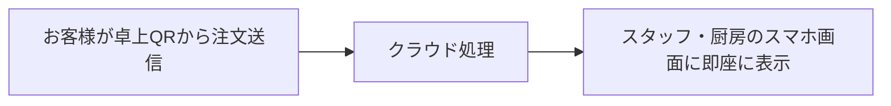

# QRコード注文にPOSレジは必要？小規模店舗のリアルな選択肢

**「QRコード注文（テーブルオーダー）」**の導入を考える際、多くの飲食店オーナー様が最初に躊躇される理由があります：
- *「大手居酒屋チェーンのように、数十万円〜百万円もする大型タッチパネルPOSレジを導入しなければならないのでは？」*
- *「厨房に専用のキッチンプリンターやモニターを設置するスペースがない……」*
- *「スタッフの私用スマートフォンだけで本当に運用できるの？」*

はっきり申し上げます：**専用のPOSレジ機器を購入する必要はまったくありません。**

最新のクラウドWeb技術を使えば、専用機器を一切買わずに、手持ちのスマートフォンだけでQR注文システムを運用できます。

---

## 1. よくある誤解：QR注文＝高額なPOSシステム導入

かつてテーブル注文システムを導入する場合、以下のような高価なパッケージを購入するのが一般的でした：
- カウンター据え置き型の専用POSレジ（30万〜100万円）
- 厨房用キッチンプリンターや専用モニター（10万〜30万円）
- 有線LAN配線工事や初期設置費用
- 月額数万円のシステム利用料や保守サポート費

このような重装備なシステムは、多店舗展開する大手チェーン店には適していても、席数が10〜20席前後の個人店やカフェにとっては過剰投資であり、スペース的にも無理があります。

---

## 2. 現代のクラウド型アプローチ：「スマートフォンが端末になる」

[TaoMenu](https://taomenu.app) のようなクラウドネイティブなサービスでは、**すべての注文受信・管理がスマホのブラウザ上で完結します**。

### 実際の現場の流れ：
1. **お客様が注文送信**：お客様がテーブルのQRコードから料理を選んで注文ボタンを押します。
2. **スタッフのスマホが通知**：ホールスタッフや厨房のスマホが音とともに新着注文（例：*3番テーブル、醤油ラーメン1杯、味玉トッピング*）を表示します。
3. **タップでステータス更新**：スタッフが画面をワンタップするだけで、「調理中」→「配膳済」→「会計完了」と直感的に管理できます。

---

## 3. 専用POSレジを使わないメリット

### 初期ハードウェア費用が完全に0円
専用のハード機器を購入する必要が一切ないため、初期投資をゼロに抑えてスタートできます。

### 停電や回線トラブルに強い
従来の据え置き型レジは、店舗の停電や固定ルーターの回線障害で完全にストップします。一方、スマホ運用ならバッテリーと4G/5Gモバイル回線でいつでも動き続けます。

### レジ周りの省スペース化
テイクアウト専門店やコーヒースタンド、狭小店舗ではレジカウンターの広さが限られます。大きなレジ機器を置かないことで、カウンターがすっきり片付きます。

---

## 4. 本当に専用POSレジが必要なケースとは？

専用の大型POSレジが必要になるのは、以下のような大規模店舗に限られます：
- 席数が50席以上あり、複数フロアにまたがる大型店
- グラム単位での厳密な在庫原価連動管理が必要な場合
- 本部一括での複雑な財務会計監査対応が必要なチェーン企業

一般的な個人経営の居酒屋、ラーメン店、カフェ、定食屋であれば、**スマートフォン型のQR注文システム**が最も手軽で実用的な選択肢です。

👉 関連リンク：
- [スマホで動く飲食店向け注文システム](/ja/phan-mem-order-tren-dien-thoai)
- [小さな飲食店に高額なPOSは本当に必要か？](/ja/blog/quan-an-nho-co-can-may-pos-khong)
- [TaoMenu の料金プラン](/ja/pricing)
