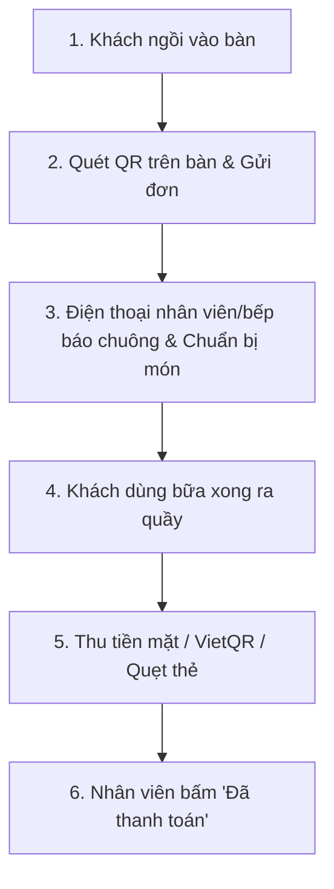

# Order bằng QR nhưng thanh toán tại quầy: Giải pháp tối ưu cho quán ăn nhỏ

Nhiều chủ quán ăn, quán cà phê khi tìm hiểu về **gọi món bằng mã QR (QR ordering)** thường có chung một băn khoăn: *"Nếu cho khách quét mã tự đặt món, có bắt buộc phải liên kết tài khoản ngân hàng phức tạp, thanh toán online ngay lúc đặt, hoặc phải mua thêm máy POS đắt tiền không?"*

Câu trả lời ngắn gọn là: **Hoàn toàn không**.

Mô hình **"Order bằng QR — Thanh toán tại quầy"** đang là lựa chọn thực tế và hiệu quả nhất cho các quán ăn độc lập, quán ăn gia đình, tiệm bánh và quán cafe vừa và nhỏ tại Việt Nam.

---

## 1. Mô hình này hoạt động như thế nào?

Quy trình vận hành thực tế tại quán diễn ra rất đơn giản và liền mạch:

1. **Khách quét mã QR dán tại bàn**: Mở menu điện tử trực tiếp trên trình duyệt điện thoại của khách mà không cần tải bất kỳ ứng dụng nào.
2. **Khách tự chọn món và bấm gửi đơn**: Khách có thể chọn kích cỡ, độ cay, ghi chú không hành, thêm topping và gửi order vào hệ thống của quán.
3. **Đơn hàng lập tức báo về điện thoại nhân viên/bếp**: Nhân viên bếp hoặc chạy bàn nhận thông báo ngay trên màn hình điện thoại của mình để chuẩn bị món.
4. **Khách dùng bữa xong và ra quầy thanh toán**: Khách báo số bàn hoặc nhân viên mang hóa đơn tạm tính đến bàn.
5. **Thanh toán theo thói quen của quán**: Quán nhận tiền mặt, đưa mã VietQR ngân hàng của chủ quán để khách quét chuyển khoản, hoặc quẹt thẻ qua máy POS hiện có.
6. **Nhân viên xác nhận hoàn tất**: Nhân viên mở điện thoại bấm "Đã thanh toán" để đóng bàn và sẵn sàng đón lượt khách tiếp theo.

---

## 2. Vì sao quán nhỏ nên chọn "Order QR + Thanh toán tại quầy"?

### Giảm 80% thời gian nhân viên phải đứng đợi khách chọn món
Vào giờ cao điểm, việc nhân viên phải đứng đợi khách phân vân đọc menu giấy từ 5-10 phút gây tắc nghẽn phục vụ. Với mã QR, khách tự xem ảnh món ăn rõ nét, tự bàn bạc và gửi đơn khi đã sẵn sàng.

### Giữ nguyên 100% dòng tiền và phương thức thanh toán quen thuộc
Quán không cần phải ký hợp đồng cổng thanh toán trung gian, không bị giữ tiền nhiều ngày và không phải chịu phí chiết khấu 1.5% - 3% trên mỗi giao dịch online. Khách muốn trả tiền mặt hay chuyển khoản VietQR thì tiền vẫn về thẳng tay hoặc tài khoản của bạn ngay lập tức.

### Không cần đầu tư máy POS hay màn hình cảm ứng cồng kềnh
Chủ quán và nhân viên chỉ cần sử dụng chính chiếc điện thoại thông minh cá nhân đang dùng hàng ngày. Mọi thao tác từ nhận order, theo dõi trạng thái món đến xác nhận thanh toán đều nằm gọn trong túi áo.

---

## 3. So sánh với các mô hình gọi món khác

| Tiêu chí | Menu giấy truyền thống | QR Order + Thanh toán tại quầy (TaoMenu) | POS Order + Bắt buộc thanh toán online |
|---|---|---|---|
| **Chi phí đầu tư ban đầu** | Thấp (in menu giấy) | **0 VNĐ (dùng điện thoại có sẵn)** | Rất cao (máy POS, máy in bill, màn hình cảm ứng) |
| **Tốc độ gọi món giờ cao điểm** | Chậm, dễ nhầm món | **Rất nhanh, khách tự gửi đơn** | Nhanh nhưng dễ kẹt ở bước thanh toán |
| **Phí trung gian thanh toán** | 0% | **0% (thu tiền trực tiếp)** | 1.5% - 3% mỗi đơn hàng |
| **Khả năng đổi giá / báo hết món** | Phải in lại toàn bộ | **Cập nhật tức thì trên điện thoại** | Phụ thuộc cấu hình phần mềm POS |
| **Phù hợp với** | Quán rất nhỏ, ít món | **Quán ăn vừa và nhỏ, cafe, tiệm bánh** | Chuỗi nhà hàng lớn, nhượng quyền |

---

## 4. Các bước triển khai cho quán của bạn trong 10 phút

Để áp dụng quy trình này vào quán ăn thực tế:

1. **Tạo tài khoản và menu**: Đăng ký tài khoản trên [TaoMenu](https://taomenu.app), nhập danh sách món hoặc chụp ảnh menu giấy sẵn có để tạo menu online.
2. **In mã QR cho từng bàn**: Tải file mã QR đã tạo sẵn số bàn (Bàn 1, Bàn 2,...) và in ra đặt tại bàn ăn hoặc dán lên standee.
3. **Mời nhân viên vào quán**: Nhân viên mở link trên điện thoại của mình để nhận thông báo khi có bàn đặt món mới.
4. **Bắt đầu phục vụ**: Hướng dẫn khách quét mã QR để gọi món, và thanh toán tại quầy khi kết thúc bữa ăn.

---

## Lời kết

Ứng dụng công nghệ cho nhà hàng không đồng nghĩa với việc phải mua sắm máy móc đắt đỏ hay làm phức tạp hóa khâu thu ngân. Bắt đầu với **Order bằng QR và thanh toán tại quầy** là bước đi thông minh, tiết kiệm chi phí và giải phóng sức lao động cho đội ngũ của bạn ngay hôm nay.

👉 Xem thêm:
- [Phần mềm order nhà hàng trên điện thoại](/vi/phan-mem-order-tren-dien-thoai)
- [Cách tạo menu QR cho quán ăn](/vi/menu-qr-cho-quan-an)
- [Bảng giá và các gói tính năng](/vi/pricing)
