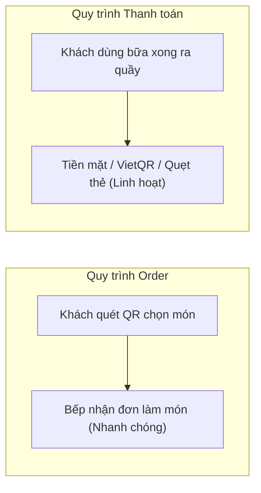

# Order bằng mã QR có bắt buộc thanh toán online không?

Một trong những rào cản lớn nhất khiến nhiều chủ quán ăn ngần ngại áp dụng mã QR là suy nghĩ: *"Cho khách quét mã gọi món đồng nghĩa với việc khách phải thanh toán online qua thẻ ngân hàng hoặc ví điện tử ngay trên trang web."*

Điều này dẫn đến hàng loạt lo lắng:
- Người lớn tuổi hoặc khách quen không thích thanh toán online, chỉ muốn trả tiền mặt.
- Quán phải làm thủ tục đăng ký cổng thanh toán phức tạp với ngân hàng.
- Tiền bán hàng bị giữ lại (đối soát vài ngày sau mới về tài khoản) và phải trả phí chiết khấu từ 1.5% đến 3% cho bên thứ ba.

Thực tế là: **Gọi món bằng QR (Ordering) và Thu tiền (Payment) là hai quy trình hoàn toàn độc lập.** Bạn hoàn toàn có thể cho khách quét QR tự đặt món nhưng vẫn thu tiền mặt hoặc chuyển khoản tại quầy như cũ.

---

## 1. Tách biệt giữa "Đặt món" và "Thanh toán" mang lại lợi ích gì?

Khi tách rời hai khâu này:

1. **Khách hàng gọi món nhanh hơn**: Khách chỉ cần tập trung chọn món mình thích và gửi đơn. Không bị gián đoạn hay bỏ cuộc vì lỗi kết nối ngân hàng hoặc quên mật khẩu OTP thanh toán.
2. **Quán kiểm soát được rủi ro**: Trong trường hợp khách muốn đổi món, gọi thêm đồ ăn kèm hoặc xin hủy món vì có việc gấp, quán xử lý trên hóa đơn thanh toán cực kỳ linh hoạt mà không cần làm thủ tục hoàn tiền (refund) phức tạp qua cổng online.
3. **Tiết kiệm 100% chi phí trung gian**: Toàn bộ doanh thu bán hàng được thu trực tiếp bằng tiền mặt hoặc chuyển khoản VietQR thẳng vào tài khoản của chủ quán mà không mất một đồng phí phần trăm nào.

---

## 2. Các phương thức thanh toán linh hoạt tại quầy

Khi sử dụng hệ thống như [TaoMenu](https://taomenu.app), sau khi khách đã thưởng thức xong bữa ăn, quán có thể thu tiền theo bất kỳ cách nào thuận tiện nhất:

- **Tiền mặt truyền thống**: Khách đưa tiền mặt, nhân viên thối tiền và bấm "Đã thanh toán" trên điện thoại.
- **Mã VietQR động/tĩnh tại quầy**: Khách quét mã VietQR dán tại quầy thu ngân để chuyển khoản ngân hàng 24/7 không mất phí.
- **Máy POS quẹt thẻ hiện có**: Nếu quán đã có sẵn máy quẹt thẻ của ngân hàng, khách vẫn có thể quẹt thẻ Visa/Mastercard bình thường.

---

## 3. Khi nào nên cân nhắc tích hợp thanh toán online?

Thanh toán online bắt buộc ngay khi quét mã chỉ thực sự cần thiết trong một số trường hợp cụ thể:
- **Mô hình quầy tự phục vụ (Self-service / Food court)**: Nơi khách lấy đồ uống hoặc đồ ăn nhanh rồi tự tìm chỗ ngồi, không có nhân viên phục vụ tại bàn.
- **Giao hàng tận nơi (Delivery)**: Cần khách thanh toán trước để tránh tình trạng bùng hàng.

Còn đối với hầu hết các quán ăn phục vụ tại bàn, quán nhậu, quán phở, bún chả, tiệm cafe... việc giữ khâu thanh toán tại quầy kết hợp với QR gọi món tại bàn là công thức vàng giúp tăng trải nghiệm khách hàng và tối ưu hiệu suất phục vụ.

---

## Tổng kết

Bạn không cần phải lo lắng về cổng thanh toán phức tạp hay phí giao dịch cắt cổ. Hãy triển khai **gọi món bằng mã QR** ngay hôm nay để giải phóng nhân viên khỏi việc ghi chép thủ công, trong khi vẫn giữ nguyên cách quản lý tài chính an toàn, thân quen của quán.

👉 Xem thêm:
- [Order bằng QR nhưng thanh toán tại quầy](/vi/blog/order-bang-qr-thanh-toan-tai-quay)
- [Phần mềm order nhà hàng trên điện thoại](/vi/phan-mem-order-tren-dien-thoai)
- [Bảng giá TaoMenu](/vi/pricing)
