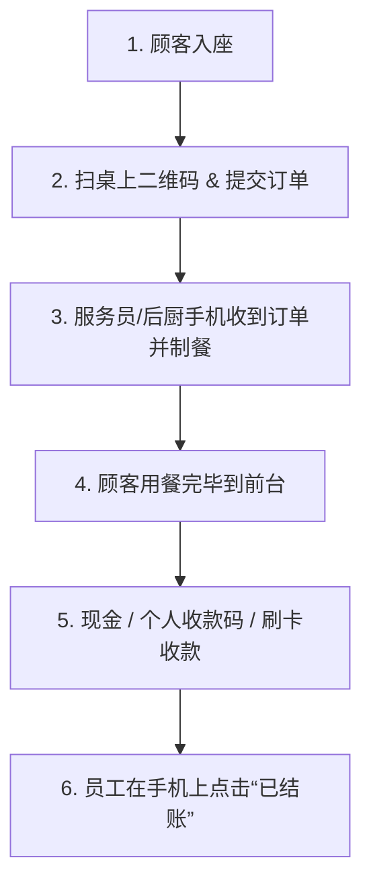

# 二维码扫码点餐+前台结账：中小餐饮店的轻量落地方案

很多中小餐厅、小吃店、咖啡馆在考虑引入**扫码点餐（QR ordering）**时，常常有几个顾虑：
- *“是不是必须对接复杂的线上支付网关，让客人点单时就强制线上付款？”*
- *“老年人或者习惯付现金的常客会不会不适应？”*
- *“是不是得花几千上万元买一套笨重的触摸屏 POS 收银机？”*

答案非常明确：**完全不需要**。

**“扫码点餐 + 前台结账”** 是目前中小独立餐饮、家庭小馆、烘焙坊和外带咖啡店最实用、最灵活且零硬件负担的落地方案。

---

## 1. 业务流程如何运转？

在店内的实际操作流程非常清晰顺畅：

1. **顾客扫桌码**：打开手机相机直接扫码，免下载 App，在手机浏览器中秒开电子菜单。
2. **自主选餐下单**：挑选菜品、规格规格（如微辣、少糖、加煎蛋）并提交订单。
3. **员工手机实时接单**：服务员或后厨手机即时响铃并弹出新订单详情（几号桌、什么菜、特殊备注），立即开始备餐。
4. **用餐完毕前台结算**：顾客到收银台报桌号，或服务员将核算账单递到桌前。
5. **按原有方式收款**：照常收取现金、出示已有收款码或在已有刷卡机上操作。
6. **员工点击完成**：员工在手机后台点击“已结账”，释放桌台迎接下一波客人。

---

## 2. 为什么中小店应选“扫码点单 + 前台结账”？

### 节省 80% 的点单等待时间
高峰期服务员不用站在桌旁苦等客人翻菜单 5 到 10 分钟。客人看着高清菜品图片自主讨论下单，大幅缓解前厅人手压力。

### 100% 保留资金流自主权，零线上渠道扣点
无需对接第三方支付服务商，不被压款结账，也不用承担 1.5% - 3% 的线上交易手续费。钱款直接落袋或进入已有账户。

### 零硬件投入，告别笨重 POS
老板和服务员直接使用自己的日常智能手机，在手机端即可完成接单、叫号、改价、沽清等全套操作。

---

## 3. 三种点餐模式对比

| 对比维度 | 传统纸质菜单 | 扫码点单+前台结账 (TaoMenu) | 传统POS机+强制线上支付 |
|---|---|---|---|
| **硬件初期投入** | 较低（印刷费） | **0 元（复用员工手机）** | 昂贵（3000~10000元设备） |
| **高峰期点单效率** | 慢，容易漏单记错 | **极快，顾客直传后厨** | 较快，但支付环节易排队卡顿 |
| **支付交易手续费** | 0% | **0%（直接收款）** | 1.5% ~ 3% 线上通道抽成 |
| **临时改价/菜品沽清** | 必须全本重印 | **手机端 1 秒即时生效** | 依赖 POS 复杂后台设置 |
| **适用场景** | 极小微摊位 | **中小餐馆、咖啡馆、烘焙坊** | 大型连锁餐饮、商场品牌店 |

---

## 4. 10 分钟快速落地指南

1. **注册与建单**：在 [TaoMenu](https://taomenu.app) 免费注册，录入菜品或直接用手机拍摄现有纸质菜单由 AI 自动识别导入。
2. **下载打印桌码**：系统自动生成每张桌子的专属二维码，一键下载 A4 打印模版并贴于桌上。
3. **邀请店员协作**：店员用微信/浏览器打开管理链接即可实时接收点单通知。
4. **开始迎客**：引导顾客扫码自主点餐，用餐后前台轻松结账。

---

## 结语

餐饮数字化绝不等于盲目采购昂贵硬件或改变成熟的财务结算流程。从**扫码点单+前台结账**开始，是最聪明、最省钱也最见效的升级捷径。

👉 了解更多：
- [手机端餐厅点餐与管理系统](/zh/phan-mem-order-tren-dien-thoai)
- [如何免费制作餐厅二维码菜单](/zh/menu-qr-cho-quan-an)
- [价格方案与功能对比](/zh/pricing)
