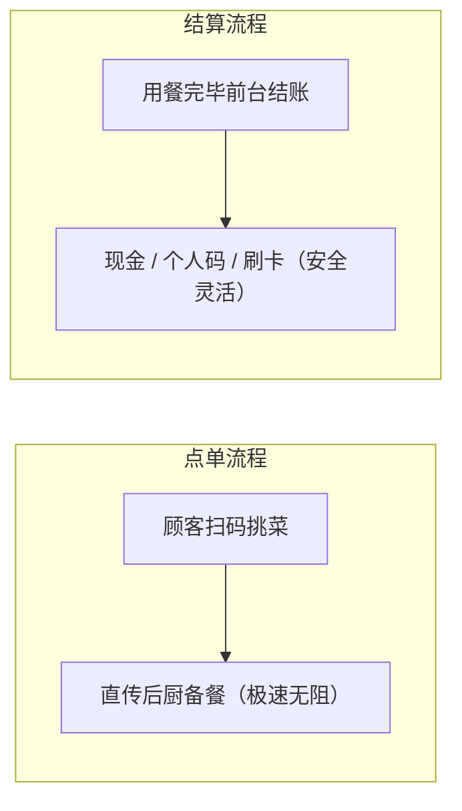

# 扫码点餐必须开通在线支付吗？点单与收款解耦优势

不少店主在了解扫码点单时存在一种思维定式：*“既然让顾客在手机网页里选菜，是不是就意味着必须把支付环节也搬到网页里，逼着客人当场绑卡或调起线上支付？”*

由此带来一系列现实阻碍：
- 部分老年顾客或常客习惯使用现金或直接转账。
- 商户需要提交繁琐的企业营业执照和第三方支付接口申请。
- 每一笔线上交易都要被支付网关抽取 1.5% 到 3% 的通道手续费，且结算资金要 T+1 甚至更久才能提现。

事实上：**“点单（Ordering）”与“收款（Payment）”是两个完全可以解耦的环节。** 

让顾客扫码只负责选菜下单，而收款继续维持原有的前台面对面结算，是中小门店最理想的运营模式。

---

## 1. “点单”与“收款”解耦带来的三大实战好处

将两部分拆开后：

1. **点单转化率更高、速度更快**：顾客无需经历繁琐的支付验证、短信验证码或因银行网络抖动导致放弃点单，选完想吃的直接提交，后厨立即开做。
2. **灵活应对临时退换与加菜**：在实际用餐中，客人临时想“换个小菜”、“加两瓶冰可乐”或“有事提前打包撤单”是家常便饭。如果线上已扣款，每次调整都要走线上退款流程；而在前台结账模式下，服务员在手机端随手加减即可，极为灵活。
3. **彻底省去线上扣点与账期风险**：所有营业额 100% 当场归集到店主自己的微信、支付宝或现金收纳盒中，没有任何中间商扣除点位，资金即时到账。

---

## 2. 丰富多样的主流前台收款方式

使用 [TaoMenu](https://taomenu.app) 系统，顾客用餐完毕后，门店可自由选择最顺手的收款工具：

- **传统现金支付**：收现金、找零钱，服务员在手机端点一下“已结账”。
- **柜台静态收款码**：顾客扫前台的个人或商家收款码，秒级直达店主账户，零额外费率。
- **已有银行刷卡机 / POS**：商户原有的小型刷卡设备继续发挥作用。

---

## 3. 什么时候才真正需要“强制在线预付”？

强制扫码立刻付款的模式通常只适用于极少数特殊场景：
- **无前厅服务的美食广场档口（Food Court）**：顾客取餐走人，没有固定桌台，必须先收钱再出餐。
- **跨区域外卖外送订单**：为了防止跑单或恶意下单。

而对于提供堂食桌台服务的面馆、炒菜馆、火锅店、烧烤店及咖啡馆，**扫码选菜+前台收款**是顾客接受度最高、门店运营阻力最小的黄金组合。

---

## 总结

数字化点餐的核心在于提升前厅点单效率与后厨沟通速度，而不是强行改变门店成熟稳定的收款方式。立即为您的店铺启用**扫码点单**，体验省心省力的智慧餐饮服务。

👉 了解更多：
- [扫码点餐+前台结账完整操作指南](/zh/blog/order-bang-qr-thanh-toan-tai-quay)
- [手机端点餐与门店管理软件](/zh/phan-mem-order-tren-dien-thoai)
- [TaoMenu 价格体系](/zh/pricing)
