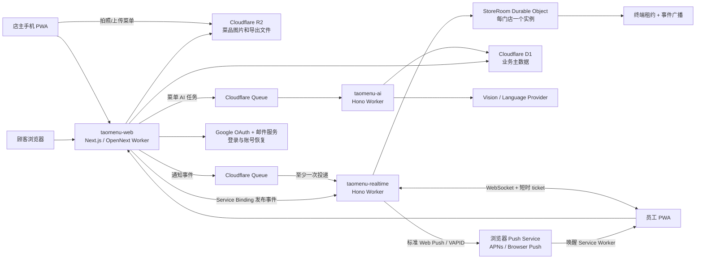

# TaoMenu 技术规格

> 2026-08-25 注：本文为历史基线（MVP 0.4 / 2026-07-27）。最新架构决策以 `DEV_NOTE.md` 为准。

- 文档状态：MVP 实施基线（已归档，仅作迁移/模型参考）
- 版本：0.4
- 更新日期：2026-07-27

## 1. 设计目标

TaoMenu 的技术架构优先解决八件事：

1. 顾客扫码即用，弱网环境下也能快速打开菜单和可靠提交订单。
2. 多个员工终端实时协作，不重复接单、不覆盖他人状态。
3. 员工 PWA 在前台、后台或锁屏时都具备明确的新订单提醒路径。
4. 每家门店的数据和权限严格隔离。
5. 第一版保持低运维、低固定成本，并复用现有项目已经验证的技术栈。
6. 店主从注册到取消订阅的所有任务都能在手机完成，桌面端只是增强而不是前提。
7. 菜单从第一天就是结构化、可追溯、可被 AI 读取和生成的数据，而不是图片或富文本孤岛。
8. 同一订单核心同时支持桌边堂食和柜台取餐，无座店不需虚构桌号或 table session。

本规格不实现支付处理、交易撮合、原生 App、打印机或后厨硬件连接。

## 2. 技术栈选择

### 2.1 从现有项目继承的基线

| 领域 | 选择 | 继承来源与理由 |
|---|---|---|
| 语言 | TypeScript，Node.js 24+ | 现有项目统一基线，减少上下文切换 |
| 包管理 | pnpm workspace | `mui-api` 等项目已使用，适合共享类型和多 Worker |
| Web | Next.js 16、React 19、App Router | `vibesite`、`mui-api/dashboard` 已验证 |
| Cloudflare 适配 | OpenNext for Cloudflare | 现有项目已有构建、D1 binding 和部署经验 |
| 实时服务 | Hono Worker + Durable Objects | 延续 `mui-api` 的 Workers-native API 风格，使用 DO 协调门店房间 |
| 员工后台通知 | Web Push + Service Worker + VAPID | iOS/Android 员工 PWA 使用同一套标准协议，顾客取餐页不申请 Push |
| 异步投递 | Cloudflare Queues + D1 outbox | 为 Push 提供重试、去重和失败追踪 |
| AI 任务 | 独立 Hono Worker + Queue + provider adapter | 图片识别、翻译和 STT 异步执行，不把长任务塞进页面请求；供应商可替换 |
| 数据库 | Cloudflare D1 + Drizzle ORM | 现有项目已有 schema、migration 和生产迁移经验 |
| 对象存储 | Cloudflare R2 | 保存菜品图片和导出的二维码/PDF |
| 认证 | Better Auth + Google OAuth + 邮箱 OTP | Google 降低手机注册摩擦，邮箱 OTP 作为独立备选和恢复通道 |
| 前端状态 | Zustand | 现有 React/Expo 项目共同使用 |
| 样式 | Tailwind CSS 4 + coss UI | 与现有 Web 规范一致 |
| 图标 | Phosphor Icons | 与现有最新项目规范一致 |
| 国际化 | next-intl | `mui-api/dashboard` 已使用，适合服务端和客户端路由 |
| 校验 | Zod | API 边界和共享事件协议统一校验 |
| 格式化 | Biome | 现有项目统一工具 |
| 单元/集成测试 | Vitest + Cloudflare Workers pool | 覆盖普通 TypeScript、D1 和 Durable Objects |
| 浏览器验收 | Playwright | 覆盖顾客、店主、员工三端闭环 |

创建项目时使用上述主版本的最新兼容版本并提交 lockfile，不在文档中锁死补丁版本。

### 2.2 为什么 MVP 不使用 Expo

第一版店主端和员工端都交付为可安装 PWA：

- 门店扫码或打开链接即可使用，无应用商店审核。
- 同一套代码覆盖 Android、iOS、平板和桌面浏览器。
- SaaS 订阅在站外完成，不引入应用内购买规则。
- 店主后台以移动 Web 为基线，员工终端本质是实时工作台，两者暂时都不需要原生硬件能力。

Web Push 已纳入 MVP。只有试点证明必须提供自定义警报声、更强的通知控制、蓝牙打印或深度离线能力时，再用 Expo 开发原生客户端，并复用共享 API 类型。

## 3. 总体架构



### 3.1 Worker 划分

#### `taomenu-web`

- 营销站和帮助页面。
- 顾客菜单和下单页面。
- 店主管理后台和员工工作台页面。
- Better Auth 路由。
- 所有业务 API、租户鉴权和 D1 持久化。
- R2 图片上传和读取授权。
- 生成实时连接 ticket，并通过 Service Binding 发布事件。
- 保存、停用和测试员工终端的 Web Push subscription。
- 业务写入时同步创建 notification outbox，并在提交后写入 Queue。

#### `taomenu-realtime`

- 员工终端 WebSocket 升级和鉴权。
- 将连接路由到 `StoreRoom` Durable Object。
- 原子执行活跃终端租约申请、续租和释放。
- 向同一门店所有活跃员工广播订单事件。
- 消费通知 Queue，使用 VAPID 向浏览器 Push Service 投递通知。
- 定时扫描未入队 outbox，处理重试和失效 subscription。
- 不直接处理菜单、订单或付款业务写入。

把 Durable Object 独立成 Worker 可以避免修改 OpenNext 生成入口，也便于本地单独测试 WebSocket 和迁移。

#### `taomenu-ai`

- 消费菜单识别、结构化、翻译和越南语 STT Queue，不暴露公开业务接口。
- 从 R2 读取店主上传的菜单图片/PDF，并调用可替换的 AI provider adapter。
- 要求 provider 返回符合共享 Zod schema 的结构化 JSON；无效输出进入可重试失败状态。
- 把生成结果保存为独立草稿和字段级建议，不直接修改已发布菜单。
- 记录 provider、model、prompt version、耗时、用量和估算成本，但不把图片内容或完整模型响应写入日志。
- 任务完成后发布站内事件；店主 PWA 已授权通知时可收到“草稿已完成”Push。
- 所有任务开始前再次读取服务端权益；Free 请求不能进入 Queue 或调用付费模型。

AI Worker 与订单路径完全隔离。AI 服务不可用时，手工建菜单、顾客点单和员工接单必须继续工作。

### 3.2 数据权威

- D1 是门店、菜单、桌台、取餐点、订单、付款和审计记录的唯一持久化业务主数据。
- `StoreRoom` 只负责短生命周期的终端租约和实时事件分发。
- WebSocket 事件是“状态发生变化”的通知，不是业务数据的唯一副本。
- Web Push 是后台提醒，不是订单状态或送达事实的唯一副本。
- 客户端收到事件后按需更新；发现版本缺口、重连或长时间未同步时，从 Web API 拉取完整快照。
- 即使实时服务暂时不可用，顾客仍能下单，员工端通过轮询最终看到订单。

## 4. 仓库结构

```text
taomenu/
├── apps/
│   ├── web/                  # Next.js、页面、Route Handlers、PWA
│   ├── realtime/             # Hono Worker、StoreRoom、通知 Queue consumer、Web Push
│   └── ai/                   # 菜单识别/翻译 Queue consumer、AI provider adapter
├── packages/
│   ├── db/                   # Drizzle schema、migration、数据库仓储
│   ├── shared/               # Zod schema、领域类型、事件和套餐权益
│   ├── ai/                   # 结构化输出 schema、prompt、provider 接口
│   ├── ui/                   # 跨页面 UI 组件，不包含业务请求
│   └── config/               # TypeScript、Biome 等共享配置
├── docs/
│   ├── PRD.md
│   ├── DESIGN_SYSTEM.md
│   ├── KEYWORD_RESEARCH.md
│   └── TECH_SPEC.md
├── migrations/               # 如由 packages/db 生成，则只保留一个权威目录
├── pnpm-workspace.yaml
└── package.json
```

约束：

- `apps/web` 和 `apps/realtime` 不各自定义重复的订单类型。
- AI 输出 schema 必须由 `packages/ai` 导出并由 Worker、API 和审核 UI 共同使用。
- 领域状态机、套餐限制和事件 payload 全部来自 `packages/shared`。
- SQL 只能通过 `packages/db` 的 schema 和 repository 层访问，禁止页面组件直接拼接 SQL。
- 文件和目录使用 kebab-case；单个业务组件或模块尽量不超过 300 行，最高不超过 400 行。

## 5. 路由设计

### 5.1 页面路由

| 路由 | 用途 |
|---|---|
| `/[locale]` | 营销站首页 |
| `/[locale]/pricing` | 套餐说明 |
| `/m/[storeSlug]/t/[tableToken]` | 顾客菜单、购物车和订单状态 |
| `/m/[storeSlug]/p/[pickupToken]` | 外带顾客菜单、购物车、取餐号和订单状态 |
| `/app` | 店主后台入口 |
| `/app/onboarding` | 门店、菜单和首张桌码引导 |
| `/app/menu` | 菜单和翻译管理 |
| `/app/menu/import` | 手机拍照/上传、AI 处理状态和草稿审核 |
| `/app/tables` | 桌台和二维码管理 |
| `/app/pickup-points` | 柜台/门口取餐点和公共取餐码管理 |
| `/app/terminals` | 终端配对与停用 |
| `/app/settings` | 门店和套餐设置 |
| `/terminal` | 员工 PWA 工作台 |

顾客菜单路由不使用语言前缀；系统根据门店已发布语言和顾客选择渲染，并将选择保存在本机。

### 5.2 API 路由

核心 Route Handlers：

```text
GET    /api/public/tables/:tableToken/menu
POST   /api/public/tables/:tableToken/orders
POST   /api/public/tables/:tableToken/service-requests
GET    /api/public/pickup-points/:pickupToken/menu
POST   /api/public/pickup-points/:pickupToken/orders
GET    /api/public/orders/:publicToken
GET    /api/public/service-requests/:publicToken

GET    /api/staff/snapshot
POST   /api/staff/orders/:orderId/accept
POST   /api/staff/orders/:orderId/serve
POST   /api/staff/orders/:orderId/ready-for-pickup
POST   /api/staff/orders/:orderId/mark-picked-up
POST   /api/staff/orders/:orderId/call-again
POST   /api/staff/orders/:orderId/cancel
POST   /api/staff/pickup-orders
POST   /api/staff/service-requests/:requestId/acknowledge
POST   /api/staff/service-requests/:requestId/resolve
POST   /api/staff/table-sessions/:sessionId/payments
POST   /api/staff/orders/:orderId/payments
POST   /api/staff/table-sessions/:sessionId/close
POST   /api/staff/realtime-ticket
POST   /api/staff/push-subscriptions
DELETE /api/staff/push-subscriptions/:subscriptionId
POST   /api/staff/push-subscriptions/:subscriptionId/test

POST   /api/owner/push-subscriptions
DELETE /api/owner/push-subscriptions/:subscriptionId
POST   /api/owner/push-subscriptions/:subscriptionId/test

POST   /api/owner/stores
PUT    /api/owner/stores/:storeId
POST   /api/owner/stores/:storeId/order-intake/pause
POST   /api/owner/stores/:storeId/order-intake/resume
CRUD   /api/owner/menu/**
CRUD   /api/owner/tables/**
CRUD   /api/owner/pickup-points/**
POST   /api/owner/terminals/pairing-codes
DELETE /api/owner/terminals/:terminalId
POST   /api/owner/menu/publish
POST   /api/owner/menu-imports
POST   /api/owner/menu-imports/:importId/assets
POST   /api/owner/menu-imports/:importId/start
GET    /api/owner/menu-imports/:importId
POST   /api/owner/menu-imports/:importId/apply
POST   /api/owner/menu/translations/suggest
POST   /api/owner/voice-commands
GET    /api/owner/voice-commands/:commandId
POST   /api/owner/voice-commands/:commandId/confirm

POST   /api/staff/voice-commands
GET    /api/staff/voice-commands/:commandId
POST   /api/staff/voice-commands/:commandId/confirm
```

核心写接口使用 JSON Route Handler，不使用只能被特定 UI 调用的 Server Action，以便 PWA、未来原生客户端和集成测试复用。

## 6. 数据模型

### 6.1 通用约定

- 主键使用 `crypto.randomUUID()` 生成的 TEXT UUID。
- 时间使用 UTC Unix millisecond INTEGER。
- 金额使用最小货币单位 INTEGER；VND 不使用小数。
- 所有租户业务表包含 `store_id`，并建立必要联合索引。
- 软删除字段使用 `archived_at`，订单和付款不物理删除。
- SQLite boolean 使用 INTEGER `0/1`。
- 图片二进制存 R2，D1 只保存 object key 和元数据。
- 所有 SQL 参数通过 Drizzle 或 prepared statement 绑定。

### 6.2 身份和租户

#### Better Auth 标准表

`user`、`session`、`account`、`verification` 由 Better Auth schema 管理。

#### `stores`

- `id`, `slug`, `name`
- `timezone`, `currency`, `base_locale`
- `service_mode`: `table_service | counter_pickup | hybrid`
- `accepting_public_requests`
- `plan`, `plan_expires_at`
- `menu_version`, `order_version`
- `is_active`, `created_at`, `updated_at`

#### `store_members`

- `store_id`, `user_id`, `role`
- MVP role 只有 `owner`；为后续 manager 预留。
- 唯一索引：`(store_id, user_id)`。

#### `terminal_devices`

- `id`, `store_id`, `name`
- `credential_hash`
- `paired_by_user_id`, `paired_at`, `revoked_at`, `last_seen_at`
- 终端长期凭证只在首次配对时返回明文，数据库只存哈希。
- 可选的本地解锁 PIN 只保存在设备端，不发送给服务端，也不构成身份凭证。

#### `terminal_pairing_codes`

- `id`, `store_id`, `code_hash`, `expires_at`, `used_at`
- 配对码一次性、短时有效，并限制尝试次数。

### 6.3 菜单

#### `menus`

- `id`, `store_id`, `name`, `status`, `published_at`
- MVP 每店一个 active menu，但数据模型允许多个。

#### `menu_categories`

- `id`, `store_id`, `menu_id`, `sort_order`, `is_available`

#### `menu_category_translations`

- `category_id`, `locale`, `name`, `description`
- `source`: `manual | ai`，`review_status`: `machine_draft | reviewed`
- `source_generation_id`, `reviewed_by_user_id`, `reviewed_at`
- 唯一索引：`(category_id, locale)`。

#### `menu_items`

- `id`, `store_id`, `category_id`
- `price_amount`, `image_key`, `sort_order`
- `is_available`, `is_sold_out`

#### `menu_item_translations`

- `item_id`, `locale`, `name`, `description`
- 与分类翻译相同的来源和审核字段。

#### `modifier_groups`

- `id`, `store_id`, `item_id`
- `min_selected`, `max_selected`, `sort_order`, `is_required`

#### `modifier_group_translations`

- `modifier_group_id`, `locale`, `name`

#### `modifiers`

- `id`, `store_id`, `modifier_group_id`
- `price_delta_amount`, `sort_order`, `is_available`

#### `modifier_translations`

- `modifier_id`, `locale`, `name`
- 与分类翻译相同的来源和审核字段。

发布菜单时执行完整性校验，并创建新的 `menu_version`。顾客订单接口必须根据服务端当前版本和价格重新计算金额。

### 6.3.1 AI 菜单导入

#### `menu_imports`

- `id`, `store_id`, `status`, `source_locale`, `target_locales_json`
- `provider`, `model`, `prompt_version`, `schema_version`
- `progress`, `error_code`, `usage_json`, `estimated_cost_usd_ticks`
- `created_by_user_id`, `created_at`, `started_at`, `completed_at`
- 状态：`draft | queued | processing | needs_review | applied | failed | cancelled`。

#### `menu_import_assets`

- `id`, `store_id`, `import_id`, `r2_key`, `mime_type`, `size_bytes`, `page_order`
- 只保存随机 object key 和必要元数据；原图设置自动删除期限。

#### `menu_import_suggestions`

- `id`, `store_id`, `import_id`, `entity_type`, `temporary_entity_key`
- `field_name`, `locale`, `suggested_value_json`, `confidence`
- `decision`: `pending | accepted | edited | rejected`
- `decided_by_user_id`, `decided_at`

导入结果不能绕过正常菜单表和发布校验。`apply` 只把店主已确认的建议写入菜单草稿，`publish` 仍是单独操作。

### 6.3.2 越南语语音指令

#### `voice_commands`

- `id`, `store_id`, `actor_type`, `actor_id`, `audio_key`
- `provider`, `model`, `prompt_version`, `schema_version`
- `transcript`, `intent`, `command_json`, `confidence_json`
- `status`: `queued | processing | needs_confirmation | executed | rejected | failed | expired`
- `confirmed_at`, `executed_at`, `expires_at`, `created_at`

原始音频存 R2 并设置短生命周期；D1 只保留审计所需的转写、结构化指令、确认和执行结果。确认接口必须重新校验实体状态和权限，不能直接重放模型输出。

### 6.4 桌台、取餐点、订单和结账

#### `dining_tables`

- `id`, `store_id`, `name`, `sort_order`
- `token_hash`, `token_version`, `is_active`
- 桌码 URL 使用随机 token；数据库只保存哈希。

#### `pickup_points`

- `id`, `store_id`, `name`, `sort_order`
- `token_hash`, `token_version`, `is_active`
- 公共取餐码 URL 使用随机 token；与桌台 token 共用生成、验证、轮换和限流组件，不复制安全逻辑。

#### `table_sessions`

- `id`, `store_id`, `table_id`
- `status`: `open | closed | force_closed`
- `opened_at`, `closed_at`, `closed_by_terminal_id`
- 每桌只能有一个 open session，写入时在同一原子批次内检查和创建。

#### `orders`

- `id`, `public_token_hash`, `store_id`
- `fulfillment_mode`: `dine_in | pickup`
- `table_id`, `table_session_id`, `pickup_point_id`；三者按履约模式为 nullable。数据库 CHECK 保证堂食必须有桌台/批次且没有取餐点；顾客外带必须有取餐点且不得有 table session；员工代建外带可以没有取餐点，但必须有 `created_by_terminal_id`。
- `display_number`, `pickup_number`, `business_date`, `status`, `locale`
- `subtotal_amount`, `note`
- `created_by_actor_type`: `customer | terminal`，`created_by_terminal_id`
- `idempotency_key`, `created_at`, `updated_at`
- 唯一索引：`(store_id, idempotency_key)`。
- 外带取餐号唯一索引：`(store_id, business_date, pickup_number)`。
- 常用索引：`(store_id, status, created_at)`、`(table_session_id, created_at)`。

#### `pickup_number_sequences`

- `store_id`, `business_date`, `next_value`, `updated_at`
- 唯一索引：`(store_id, business_date)`。
- 使用单条 `INSERT ... ON CONFLICT DO UPDATE ... RETURNING` 原子取号；`business_date` 以门店时区和可配置营业日分界计算，不以 Worker UTC 零点直接重置。

#### `service_requests`

- `id`, `public_token_hash`, `store_id`, `table_id`, `table_session_id`
- `type`: `call_staff | request_bill`
- `status`: `open | acknowledged | resolved | cancelled`
- `idempotency_key`, `created_at`, `acknowledged_at`, `resolved_at`
- `acknowledged_by_terminal_id`, `resolved_by_terminal_id`
- 同桌同类型只允许一个 `open/acknowledged` 请求；重复提交返回已有请求及状态。
- `request_bill` 必须关联 open table session；`call_staff` 允许在尚未下单时使用。

#### `order_items`

- `id`, `order_id`, `menu_item_id`, `quantity`
- `name_snapshot`, `unit_price_amount`, `line_total_amount`
- 快照保证菜单修改后历史账单不变。

#### `order_item_modifiers`

- `id`, `order_item_id`, `modifier_id`
- `name_snapshot`, `price_delta_snapshot`

#### `payments`

- `id`, `store_id`, `table_session_id`, `order_id`
- 数据库 CHECK 保证 `table_session_id` 与 `order_id` 必须且只能填一个；堂食付款记到批次，外带付款记到单笔订单。
- `type`: `payment | reversal`
- `method`: `cash | bank_transfer | other`
- `amount`, `reverses_payment_id`
- `recorded_by_terminal_id`, `created_at`, `note`
- 付款是门店人工记录；系统不保存资金账户和支付凭证。

#### `audit_logs`

- `id`, `store_id`, `actor_type`, `actor_id`
- `action`, `entity_type`, `entity_id`
- `before_json`, `after_json`, `created_at`
- 不记录认证 token、完整请求头和顾客 IP。

### 6.5 Push Notification

#### `push_subscriptions`

- `id`, `store_id`, `subject_type`: `terminal | owner`
- `terminal_id`, `user_id`；数据库约束二者必须且只能存在一个，并与 `subject_type` 一致
- `endpoint`, `p256dh_key`, `auth_key`
- `platform`, `created_at`, `last_success_at`, `disabled_at`
- endpoint 是高敏感 capability URL，不得写入日志或返回给其他终端。
- 唯一索引：`endpoint`；一个终端或店主允许多个有效 subscription，以兼容重新安装和浏览器变化。
- 新订单和服务请求只发给当前门店的 `terminal`；AI 菜单草稿完成只发给发起任务的 `owner`。

#### `notification_outbox`

- `id`, `store_id`, `event_type`, `entity_id`
- `not_before`, `status`, `attempts`, `created_at`, `queued_at`
- 与订单业务数据在同一个 D1 batch 中写入，避免订单成功但没有任何通知投递记录。

#### `notification_deliveries`

- `event_id`, `subscription_id`, `status`, `response_code`
- `attempts`, `last_attempt_at`, `delivered_at`
- 唯一索引：`(event_id, subscription_id)`，用于处理 Queue 的至少一次投递语义。
- Push endpoint 返回永久失效状态时停用 subscription，不再重试。

### 6.6 套餐与计费

#### `subscriptions`

- `id`, `store_id`, `provider`, `provider_customer_id`
- `provider_subscription_id`, `status`, `current_period_end`
- MVP `provider` 可以是 `manual`；公开测试再接 Stripe Checkout/Billing。
- 公测首个定价实验为 `149000 VND/month` 和 `1490000 VND/year`；价格 ID、币种和可见性由服务端配置，不散落硬编码在前端。

#### `entitlement_overrides`

- 管理员对试点门店临时授予 Pro 或调整额度。
- 权益计算优先级：有效 override > 有效 subscription > Free 默认值。

套餐常量由 `packages/shared` 提供：

```typescript
type PlanEntitlements = {
  maxPublishedMenuLocales: number;
  maxActiveStaffTerminals: number;
  canUseAiMenuImport: boolean;
  canUseAiTranslation: boolean;
  canUseVoiceAssistant: boolean;
};
```

菜单数量、菜品数量、桌台数量和顾客订单数不作为 MVP 套餐限制。

Free 的三个 AI 布尔权益均为 `false`，Pro 均为 `true`。每个创建任务的 API 和 Queue consumer 都必须校验权益；前端隐藏或禁用按钮不是授权控制。

## 7. 关键领域逻辑

### 7.1 顾客下单事务

服务端按以下顺序处理：

1. 校验桌码或取餐点 token，取得唯一 `store_id` 以及 `table_id` 或 `pickup_point_id`；员工代建外带订单则校验 terminal credential。
2. 校验 `Idempotency-Key` 格式并查询是否已处理。
3. 加载服务端当前可售菜单项和规格。
4. 拒绝售罄、下架、数量越界和非法规格组合。
5. 完全由服务端计算单价、附加价和总价。
6. 堂食订单获取当前 open table session，不存在则创建；外带订单不创建 table session，而是按门店时区计算 `business_date` 并原子分配取餐号。
7. 在 D1 batch 中写入订单、明细、快照、notification outbox 和审计记录，并增加 `order_version`；外带订单同时依赖 `(store_id, business_date, pickup_number)` 唯一约束作为最终防重。
8. 返回订单 public token、版本号和可选取餐号。
9. 通过 Service Binding 向 `StoreRoom` 发布 `order.created`，提醒正在前台的员工终端。
10. 将 outbox 事件写入通知 Queue，供后台 Push consumer 处理。

如果第 9 或第 10 步失败，订单仍然成功；未入队 outbox 由定时任务补发，员工端轮询/重同步继续兜底。禁止因通知失败而重试创建订单。

### 7.2 状态机

```text
堂食: submitted -> accepted -> served
           |           |
           +-----------+-> cancelled

外带: submitted -> accepted -> ready_for_pickup -> picked_up
           |           |                    |
           +-----------+--------------------+-> cancelled
```

- 每个状态修改请求包含客户端已知 `updated_at` 或 version。
- 版本不匹配返回 `409 Conflict` 和服务端最新状态。
- 客户端显示“已被其他员工处理”，而不是静默覆盖。
- 堂食的 `served`、外带的 `picked_up` 以及两者的 `cancelled` 为订单终态。
- `ready_for_pickup` 只适用于外带；`call-again` 只记录叫号次数和操作者，不是状态转移。

### 7.3 桌台账单

```text
应付金额 = 所有非 cancelled 订单金额
已付金额 = payment 总和 - reversal 总和
待付金额 = 应付金额 - 已付金额
```

- 正常关闭要求待付金额等于零。
- 强制关闭需要 owner 权限或预先配置的 manager 权限，并写审计日志。
- 不允许付款冲正后形成无法解释的负数余额。

### 7.3.1 外带订单结账

- 应付金额来自单笔外带订单的非取消明细，付款与冲正直接关联 `order_id`。
- 外带订单不与同一取餐点的其他订单聚合，也不存在“关闭取餐点账单”操作。
- 默认要求余额为零才可标记 `picked_up`；店主可配置“先取餐后付款”，但例外必须有明确提示和审计记录。

### 7.4 服务请求

1. 校验桌码 token、门店 `accepting_public_requests` 和桌台状态。
2. 校验幂等键、桌号短时频率与同类未完成请求。
3. `request_bill` 要求存在 open table session；请求本身不创建付款也不关闭桌台。
4. 在 D1 batch 中写入请求、通知 outbox、审计日志并增加 `order_version`。
5. 员工前台通过 WebSocket 收到事件，后台通过 Web Push 提醒；顾客页面不在后台持续轮询，重新聚焦、pageshow 或主动刷新时再获取新状态。

## 8. 实时同步与终端并发

### 8.1 连接流程

1. 配对终端用长期凭证向 Web API 换取 60 秒有效的 realtime ticket。
2. ticket 包含 `storeId`、`terminalId`、`plan`、`exp` 和随机 `jti`，由服务端签名。
3. 员工端连接 `wss://realtime.taomenu.app/ws?ticket=...`。
4. Realtime Worker 验签后以 `storeId` 定位 `StoreRoom`。
5. `StoreRoom` 原子申请或续租该 `terminalId` 的活跃席位。
6. 超出套餐额度时关闭连接并返回明确业务错误码。
7. 成功后 WebSocket 使用 Hibernation API 接管。

### 8.2 终端租约

- 终端每 30 秒发送 heartbeat。
- 租约 90 秒未续期即过期。
- 同一 `terminalId` 重连只续租，不重复占用席位。
- 正常关闭立即释放；异常掉线由过期清理释放。
- Free 容量为 1，Pro 容量为 5。
- 店主撤销终端后，Web API 拒绝换票，Realtime Worker 主动断开现有连接。

租约数据保存在 Durable Object SQLite storage，不能只存在内存中；WebSocket attachment 保存 `terminalId` 等恢复连接所需的少量信息。

### 8.3 事件协议

```typescript
type StoreEvent = {
  id: string;
  storeId: string;
  version: number;
  occurredAt: number;
  type:
    | 'order.created'
    | 'order.updated'
    | 'service-request.created'
    | 'service-request.updated'
    | 'payment.recorded'
    | 'table-session.closed'
    | 'terminal.revoked';
  entityId: string;
};
```

事件只包含刷新所需标识，不广播完整订单备注和账单内容。员工端收到事件后从已鉴权 API 获取最新实体或快照。

### 8.4 重连和一致性

- 客户端指数退避重连，最大间隔 30 秒。
- 连接成功后立即请求 `/api/staff/snapshot?sinceVersion=...`。
- 事件 version 不连续时执行全量快照同步。
- 工作台处于前台时每 30 秒做一次轻量版本检查，作为漏事件兜底。
- WebSocket 断开时禁止假装实时；显示连接状态和最后同步时间。
- 客户端发出的状态修改始终走 Web API，不能通过 WebSocket 直接写业务数据。

### 8.5 Web Push 投递

前台 WebSocket 和后台 Web Push 解决不同生命周期问题：

- PWA 在前台：WebSocket 立即同步，页面播放声音并更新订单列表。
- PWA 在后台、锁屏或未打开：浏览器 Push Service 唤醒 Service Worker，显示系统通知和应用角标。
- 用户点击通知：打开或聚焦 `/terminal?order=<id>`，随后通过已鉴权 API 拉取最新订单。
- PWA 恢复前台：无论是否收到 Push，都执行 version/snapshot 同步。

iOS/iPadOS 要求：

- 系统版本至少支持 Home Screen Web Push。
- 员工先把 PWA 添加到主屏幕。
- `manifest` 使用 `standalone`，并设置稳定 `id`。
- 通知权限请求必须由员工点击“开启通知”触发。

Android/Chromium 同样使用 Service Worker、Push API 和 Notifications API。所有平台使用 feature detection，不能按 User-Agent 猜测能力。

投递流程：

1. 员工终端完成配对后注册 Service Worker，并用 VAPID public key 创建 subscription。
2. subscription 通过鉴权 API 绑定到 `terminal_id`。
3. 新订单事务写入 outbox；提交后发送 Queue 消息。
4. Queue consumer 在短延迟后重新检查订单。如果订单仍为 `submitted`，向当前门店有效 subscription 发送 Push。
5. payload 只包含 event ID、桌号、订单显示号和跳转 URL，不包含顾客备注或完整订单。
6. consumer 以 `(event_id, subscription_id)` 去重；临时错误重试，永久失效 endpoint 被停用。
7. Queue 配置 Dead Letter Queue，并对持续失败发出告警。

Push 是尽力投递：系统可能因权限、Focus/勿扰模式、省电策略、网络或浏览器策略而延迟、静音或丢弃。因此：

- 不用 Push 回执判断订单是否被员工看到。
- 记录 `notification.clicked` 和订单首次 `viewed/accepted` 时间衡量真实效果。
- 营业准备页必须提供“发送测试通知”。
- 建议营业时至少一台员工终端保持前台、WebSocket 在线并开启声音。
- 未接受订单超过阈值时可再发送一次升级提醒，但必须限制频率。

### 8.6 为什么不使用 WebRTC

WebRTC 面向浏览器之间的点对点音视频或数据通道，需要额外的 signaling，并可能经过 STUN/TURN。它不能在 PWA 被系统挂起后替代 Push 唤醒 Service Worker，也会把多员工协作变成更复杂的 peer topology。

TaoMenu 的数据模式是“服务器保存权威订单，再向少量员工终端广播事件”，WebSocket 更直接、可审计且易于重连。每店最多五个员工终端，订单事件体积很小，不构成 WebSocket 性能压力。

## 9. 认证与授权

### 9.1 店主

- Better Auth 支持 Google OAuth 和邮箱 OTP；Google 是快捷入口，邮箱 OTP 作为无 Google 账号时的备选和恢复通道。
- MVP 不接入短信 OTP 或 Zalo Login，避免在未验证需求前引入电话号合规、短信到达率和双账号合并复杂度。
- 每次 owner API 调用从服务端 session 取得 `userId`。
- repository 查询必须同时带 `storeId` 和已验证 membership。
- 管理菜单、桌台、取餐点、终端和套餐需要 owner 权限。

### 9.2 员工终端

- 店主生成一次性配对码，终端换取随机高熵凭证。
- 长期凭证保存于浏览器受限存储，服务端只存哈希。
- 本地 PIN 只加锁 UI；真正 API 请求仍使用终端凭证。
- 终端默认只能查看和操作本门店订单、桌台、取餐队列和付款记录。

### 9.3 顾客

- 无账户、无 cookie 身份要求。
- 桌码 token 只授予读取当前门店已发布菜单和向当前桌台下单的能力；取餐点 token 只授予读取同一菜单和创建独立外带订单的能力。
- 订单 public token 只允许查看该订单的有限状态，不返回门店后台信息。
- 取餐号是可公开叫号的显示标识，不作为订单查询凭证。

### 9.4 租户隔离

D1 没有应用级自动行权限，必须通过代码约束：

- 所有业务表包含 `store_id`。
- repository 函数第一参数为经过鉴权的 `StoreContext`。
- 禁止提供仅按实体 `id` 查询的后台 repository；必须同时按 `store_id` 查询。
- 自动化测试为每个敏感接口创建两个门店，验证跨租户 ID 返回 `404`。
- 审计日志记录越权尝试的事件类型，但不保存敏感 payload。

## 10. 安全和滥用防护

- 所有输入用 Zod 校验，菜单文本长度、订单数量和备注长度有上限。
- React 默认转义商户输入；富文本不在 MVP 范围。
- 顾客下单使用桌码、幂等键和按桌台/IP 摘要的速率限制。
- 公共取餐码使用独立的短时提交、待处理订单和 IP 摘要限额；它不能因为多位正常顾客共用同一 token 而复用“同桌只允许一个未完成请求”规则。
- 每桌限制短时提交、待处理订单数和同类服务请求；反复被员工取消后对该桌码进入短时冷却。
- 店主可将 `accepting_public_requests` 立即设为 false，在不下架菜单的情况下暂停新订单和服务请求。
- 桌码 token 可轮换；风险判定不强制要求定位、蓝牙或同一 Wi-Fi，也不将完整 IP 写入业务数据。
- IP 只用于短时限流，不写入长期业务表。
- 配对码和登录 OTP 限制尝试次数，并在异常流量时接入 Turnstile。
- 设置 CSP、`frame-ancestors`、安全 cookie 和严格的 CORS allowlist。
- R2 上传验证 MIME、文件头、大小和图片像素，使用随机 object key。
- secret 只保存在 Cloudflare Secrets，不提交 `.env` 或 `.dev.vars`。
- 所有金额、状态和套餐授权在服务端验证。

## 11. PWA 与弱网策略

### 11.1 顾客端

- 静态壳、字体和通用图标可缓存。
- 菜单采用短缓存并携带 `menu_version`/ETag；售罄状态提交时再次校验。
- 订单提交按钮在请求期间锁定，并使用稳定 idempotency key 重试。
- 未收到服务端成功响应前不显示“下单成功”。
- 订单 public token 保存在当前浏览器的订单历史中，顾客可在切换 App 或页面被系统回收后恢复状态页。
- 页面隐藏时停止状态轮询；在 `visibilitychange` 回到 `visible`、`pageshow`、用户下拉刷新或点击“刷新进度”时调用 `GET /api/public/orders/:publicToken`。
- 订单状态接口返回 `Cache-Control: no-store`和服务端 `updated_at/version`；多个恢复事件同时触发时合并为一次请求，旧请求用 `AbortController` 取消，避免旧响应覆盖新状态。
- 取餐顾客端不注册 Service Worker Push subscription，不申请通知权限；员工口头叫号是 MVP 的主通知渠道。

### 11.2 员工端

- IndexedDB 保存最后一次完整快照，仅供断网时只读展示。
- 业务写操作不做离线队列，避免恢复网络后错误接单或重复结账。
- 恢复连接后先同步服务端状态，再恢复操作。
- 通过 manifest 安装到主屏幕；Service Worker 同时负责静态缓存和 Push event。
- 配对完成后展示通知能力检查，不在页面首次加载时直接请求权限。
- 授权后立即发送测试 Push；只有收到并点击测试通知，设备才标记为“通知已验证”。
- Service Worker 的 `notificationclick` 复用已有 PWA 窗口或打开对应订单。
- 处理 `pushsubscriptionchange`，并在每次启动时校验 subscription 是否仍有效。
- 系统通知使用简短通用文案；完整订单必须打开 PWA 后读取。
- 前台音频提醒需要员工在每次启动后主动启用。

### 11.3 店主端

- `/app` 与 `/terminal` 共用可安装 PWA 基础，但入口和权限分开；店主不需要安装才能完成任何操作。
- 以 360px 宽竖屏为最低布局基线，核心动作固定在拇指可达区域，不出现必须横向滚动的后台数据表。
- 排序同时提供触摸拖拽和明确的上移/下移按钮；批量选择不能依赖 Shift/Ctrl 键。
- 菜单拍摄入口使用 `accept="image/*"` 和用户触发的 `capture="environment"`，同时保留相册与 PDF 上传。
- 图片先在本机生成小预览并校正方向，再直接上传 R2；弱网上传显示逐文件进度，可重试失败文件，不重复已完成上传。
- 长表单按步骤拆分并自动保存到服务端草稿；IndexedDB 仅保存尚未提交的临时输入和上传队列。
- 处理软键盘、safe-area、返回手势和页面恢复；关键提交后显示可验证的服务端状态。
- QR 图片、PDF 和公开菜单链接优先调用 Web Share API，能力不存在时提供下载与复制链接回退。
- Free 菜单编辑器只使用手工表单；拍照导入、AI 翻译和语音入口展示 Pro 标识，未升级时不得申请相机/麦克风权限或上传素材。
- Free 手工编辑器提供保存并继续、复制菜品、默认沿用分类/规格、`inputmode="numeric"` 价格键盘、批量上下架和自动保存；不以降低 Free 可用性制造升级压力。
- 颜色 token、组件状态、布局和窄屏验收以 [TaoMenu 设计系统](./DESIGN_SYSTEM.md) 为权威来源。

## 12. 国际化

- 系统 UI 文案使用 next-intl，第一批 locale 为 `vi`、`en`，随后加入 `zh-CN`。
- 菜单翻译存数据库，不写入系统 message 文件。
- locale 使用 BCP 47 标识。
- 价格通过 `Intl.NumberFormat` 按门店币种格式化。
- 数据库保存 UTC 时间，员工端按 `Asia/Ho_Chi_Minh` 等门店时区展示。
- Free/Pro 的语言限制只作用于“菜单发布”，不限制系统界面切换。

## 13. AI 菜单管线

### 13.1 任务流程

1. Web API 创建 `menu_import`，向每个素材签发短时上传授权。
2. 店主手机把图片/PDF 直接上传 R2；服务端验证 MIME、文件头、页数、体积和像素上限。
3. 店主点击开始后，API 冻结本次素材清单并以幂等键写入 Queue。
4. AI Worker 先识别源语言，再提取分类、菜品、描述、价格和规格，返回版本化 JSON schema。
5. Worker 用 Zod 校验结果；可修复错误最多重试一次，仍不合法则标记失败并允许店主手工继续。
6. 对价格、币种、过敏原和规格规则执行确定性校验，不用模型结果代替业务规则。
7. UI 以字段级差异显示建议和置信度，店主接受、修改或拒绝。
8. `apply` 把确认结果写入菜单草稿；`publish` 再执行完整发布校验。

### 13.2 Provider 边界

```typescript
type MenuAiProvider = {
  extractMenu(input: ExtractMenuInput): Promise<MenuImportOutput>;
  translateMenu(input: TranslateMenuInput): Promise<MenuTranslationOutput>;
  transcribeVietnamese(input: TranscribeInput): Promise<TranscriptOutput>;
};
```

- 业务代码只依赖上述接口和共享 schema，不把供应商 message 格式带进领域层。
- provider 配置按能力选择模型；模型 ID、prompt 和 schema 都要版本化，切换模型不改变 API 合同。
- 请求设置超时、重试和最大成本；同一 import 幂等重放不会重复计费或覆盖已审核结果。
- Prompt 要求保持原文、整数 VND、项目顺序和不确定性，不允许模型凭空补充菜品或价格。
- AI 草稿永不自动发布；人工修改具有最高优先级，重新生成不能覆盖已审核字段。

### 13.3 数据与隐私

- 只把完成当前任务所需的菜单图片和文本发送给模型，不发送顾客订单、备注、员工凭证或付款数据。
- 上传前向店主说明处理用途和第三方模型参与；原始素材使用生命周期规则自动删除。
- 默认不允许供应商用业务数据训练模型；provider 合同和区域能力在上线前单独复核。
- 日志仅记录 job ID、store ID、模型、耗时、token/图片用量、错误码和成本，不记录完整输入输出。
- 字段接受、编辑和拒绝事件用于衡量质量；若未来用于训练或长期样本库，必须另行取得明确授权。

### 13.4 Pro 越南语语音指令

1. PWA 使用 `getUserMedia` + `MediaRecorder` 录制用户主动触发的短语音，不依赖兼容性不足的浏览器 `SpeechRecognition`。
2. 客户端先取得一次性上传授权，把音频上传 R2，再创建 `voice_command`；Free 在签发上传授权前即被拒绝。
3. STT Prompt/Keyterms 动态包含当前菜单菜名、规格、桌号、取餐号、付款方式和常用越南语动作。
4. 转写文本交给结构化解析器，输出版本化 command schema；金额统一转换为整数 VND。
5. 只读导航指令可以立即返回结果；所有业务写操作进入 `needs_confirmation`。
6. 确认卡显示原始转写以及解析出的动作、目标、数量和金额，用户点击后才调用正常业务 API。
7. 正常业务 API 重新验证 actor 权限、实体版本、套餐和状态机，并使用幂等键防止重复执行。
8. 音频、转写或解析置信度不足时返回候选项或失败，不允许推测执行。

首轮 provider 评测至少包含 `gpt-4o-transcribe`、ElevenLabs Scribe、Google Chirp 和一家越南本地服务。最终选择依据北/中/南真实餐馆录音的关键字段错误率、P95 延迟、失败率和成本，而不是通用 WER 或厂商宣传。

## 14. 搜索与 AI 可发现性

- 越南语营销页使用 Next.js 服务端渲染或静态生成，主要信息必须存在于初始语义 HTML 中。
- 建立 `vi` 为主的功能/问题落地页，并用 canonical 与 `hreflang` 连接 `vi`、`en`、`zh-CN` 版本。
- `sitemap.xml` 只包含营销、定价、帮助和明确希望被索引的页面；`/app`、`/terminal`、API、桌码和取餐码菜单返回 `noindex`。
- 首页输出真实的 `WebSite`、`Organization` 和 `FAQPage` JSON-LD；没有真实评价时不声明 `SoftwareApplication`（Google Software App 富结果要求 rating/review，不伪造评分——issue #10）。
- 内容模型保存 slug、标题、摘要、正文块、locale、发布日期、更新时间和来源链接，便于搜索引擎与 AI 系统稳定引用。
- 页面采用问题式 H2、简短直接答案、步骤、限制和 FAQ；不得批量生成只替换关键词的薄页面。
- 上线时接入 Google Search Console 和 Bing Webmaster Tools；发布或更新营销页后更新 sitemap，可选接入 IndexNow。
- `llms.txt` 仅作为后续实验，不计入 SEO 完成标准。

## 15. 图片与二维码

- 菜品图片上传到 R2，后台生成或请求适合菜单的缩略尺寸。
- MVP 每个菜品一张图片，原图设置合理体积上限。
- 桌码和取餐码 PDF 在请求时生成并缓存到 R2，token 版本变化时生成新文件。
- QR payload 使用完整 HTTPS URL；`.app` 强制 HTTPS 与产品要求一致。
- 二维码打印稿同时显示门店名、桌号或“在此点单取餐”、以及短网址，扫码失败时仍可手动输入。

## 16. 可观测性

### 16.1 日志

结构化日志至少包含：

- `requestId`, `worker`, `route`, `status`, `durationMs`
- 已认证请求的 `storeId`、actor 类型和 actor ID
- 订单相关的 entity ID 和 event version
- 不记录 OTP、session、terminal credential、桌码原 token 和订单备注

### 16.2 指标

- API 请求量、错误率和 P95 延迟。
- D1 查询错误和 migration 版本。
- WebSocket 当前连接、拒绝连接、重连和租约占用。
- 实时发布失败和客户端版本缺口次数。
- Push subscription 有效率、发送成功/永久失效/重试和 DLQ 数量。
- 从订单创建到首次查看、接受的延迟；不能把 Push API 成功响应等同于用户已看到。
- 顾客下单成功率、重复提交命中率。
- 外带订单从接受到 `ready_for_pickup`、再到 `picked_up` 的 P50/P95 时长，以及 `call-again` 使用率。
- 取餐号分配冲突/重试次数和唯一约束失败数。
- 顾客订单页在 `visibilitychange/pageshow` 后的刷新成功率；不建立后台心跳或顾客 Push 送达指标。
- 服务请求创建/确认/完成延迟、同类合并率和滥用冷却触发次数。
- AI import 排队/处理时长、schema 校验失败率、成本、字段接受率和价格修正率。
- STT 按地区口音统计的关键字段错误率、命令解析成功率、确认取消率、P50/P95 延迟和每分钟成本。
- 按 landing page 和 search query 聚合的注册、首份菜单发布和首笔真实订单转化。

初期使用 Workers Observability 和 Web Analytics；当错误量需要跨端关联时再接 Sentry。

## 17. 测试策略

### 17.1 单元测试

- 金额计算和 modifier 组合。
- 订单状态机。
- 桌台应付/已付/待付计算。
- 外带订单状态机、单笔余额和门店时区营业日计算。
- 取餐号格式化、原子递增和当日唯一性。
- 套餐权益和降级规则。
- locale 回退和菜单发布校验。
- Zod API schema。
- AI 输出 schema、价格确定性校验和审核状态转换。

### 17.2 Worker 集成测试

使用 Cloudflare Vitest pool 测试：

- D1 migration 从空库完整执行。
- 顾客下单 D1 batch 和幂等性。
- 公共取餐码并发下单、员工代建外带订单，以及同一营业日内取餐号不重复。
- 外带订单付款关联 `order_id`，不创建 table session，不与其他外带订单合并。
- 服务请求幂等、同类合并、状态流转和暂停营业拦截。
- 每桌待处理上限、取消冷却和 token 轮换后旧桌码失效。
- 两门店数据隔离。
- `StoreRoom` 终端租约上限、续租、过期和撤销。
- WebSocket 重连后的 snapshot/version 行为。
- 实时发布失败时订单仍持久化。
- outbox 未入队补发、Queue 重复投递去重和 Push 失败重试。
- 永久失效 subscription 自动停用，且 endpoint 不出现在日志中。
- AI Queue 幂等、无效结构化输出、provider 超时、失败恢复和“未经审核不能发布”。
- Free 无法创建菜单识别、翻译或语音任务；绕过 UI 直接调用 API 也返回权益错误且不产生模型费用。
- 语音命令金额/桌号误识别、过期确认、重复确认和实体版本冲突。

### 17.3 组件测试

- 顾客购物车和提交状态。
- 顾客切到后台时停止刷新，在 `visibilitychange/pageshow` 或下拉刷新后更新取餐进度。
- 新订单提示、冲突提示和断线状态。
- 取餐队列的大号码、可取餐、再次叫号和已取餐操作。
- 呼叫服务员/请求结账提示、合并状态和员工确认操作。
- 多语言缺失提示。
- 终端上限和升级引导。
- 手机拍照上传、逐文件重试、AI 字段审核和低置信度价格提示。
- 越南语转写确认卡、候选项、拒绝/修改和语音不可用时的手工回退。

### 17.4 Playwright E2E

必须覆盖以下闭环：

1. 店主注册 → 创建门店 → 发布菜单 → 创建桌台。
2. 两名顾客向同桌分别下单 → 员工看到两笔订单。
3. 员工接受/上菜 → 另一终端实时更新。
4. 记录两笔付款 → 余额归零 → 关闭桌台。
5. 下一位顾客扫码 → 创建新的 table session。
6. Free 第二员工终端被拒绝，升级 Pro 后可以连接。
7. 第二门店无法读取第一门店实体。
8. Android 和 iOS 真机完成安装、授权、测试 Push、锁屏收单和点击跳转。
9. Free 店主只用 360px 宽手机视口手工建菜单；Pro 店主在同一视口完成拍照导入、语音输入和审核；两者都能完成注册、建桌、分享桌码和套餐管理。
10. AI provider 故障时店主仍能手工完成菜单并发布。
11. Free 全流程只能手工录入且不能调用 AI/STT；升级 Pro 后才可使用拍照导入、AI 翻译和语音助手。
12. Pro 越南语语音写操作未经点击确认不会改变菜单、订单、付款或桌台数据。
13. 顾客呼叫服务员/请求结账 → 员工确认/完成 → 顾客看到新状态。
14. 恶意重复订单和请求被合并或冷却；店主暂停后新提交被拒绝，轮换 token 后旧桌码失效。
15. 柜台取餐门店无桌台完成开店 → 顾客扫公共取餐码 → 获得取餐号 → 员工标记可取/口头叫号 → 已取餐。
16. 顾客下单后切到其他 App，页面在后台不轮询、不申请 Push；切回或下拉刷新后看到最新取餐状态。
17. 20 笔并发外带订单获得 20 个不重复取餐号，每笔付款和明细互不串单。

## 18. 本地开发和脚本

根目录预期脚本：

```json
{
  "scripts": {
    "dev": "pnpm --parallel --filter './apps/*' dev",
    "build": "pnpm -r build",
    "format": "biome check --write",
    "lint": "biome check",
    "typecheck": "pnpm -r typecheck",
    "test": "pnpm -r test",
    "test:e2e": "pnpm --filter @taomenu/web test:e2e",
    "db:generate": "pnpm --filter @taomenu/db db:generate",
    "db:migrate:local": "pnpm --filter @taomenu/db db:migrate:local",
    "db:migrate:prod": "pnpm --filter @taomenu/db db:migrate:prod"
  }
}
```

开发环境：

- Web 使用 Next.js dev server。
- Realtime 使用 `wrangler dev` 和本地 Durable Objects。
- D1、R2 和 DO 默认使用本地资源；需要验证平台差异时显式使用 staging remote bindings。
- 每次修改 Wrangler binding 后运行 `wrangler types`。

## 19. 部署拓扑

### 19.1 Production

- `taomenu.app`、`www.taomenu.app` → `taomenu-web`
- `realtime.taomenu.app` → `taomenu-realtime`
- D1：`taomenu-production`
- R2：`taomenu-assets-production`
- DO namespace：由 `taomenu-realtime` 管理
- AI Queue 和 `taomenu-ai` Worker：使用独立 secrets 和消费重试/DLQ 配置
- 创建 D1 时使用 APAC location hint，使主库初始位置尽量接近越南；最终位置由 Cloudflare 决定。

### 19.2 Staging

- `staging.taomenu.app`
- `realtime-staging.taomenu.app`
- 独立 D1、R2、DO namespace 和 secrets

禁止 staging 连接 production D1。Cloudflare migration 先在本地和 staging 验证，再应用到 production；部署后执行 schema smoke test 和完整关键路径检查。

## 20. CI/CD

GitHub Actions 对每个 PR 执行：

1. `pnpm install --frozen-lockfile`
2. `pnpm run lint`
3. `pnpm run typecheck`
4. `pnpm run test`
5. `pnpm run build`
6. migration 空库测试
7. 关键 Playwright 测试

合并默认分支后部署 staging；production 初期手工批准。D1 migration 与应用部署分成可观察步骤，部署记录必须包含 migration 版本和 Worker version。

## 21. 关键架构决策

### ADR-001：PWA 优先于原生 App

结论：MVP 只交付 PWA。原因是无需商店审核、部署快、覆盖设备广，当前也没有必须使用的原生硬件接口。

### ADR-002：D1 是业务主库，Durable Object 只做门店实时协调

结论：不把完整订单主数据拆到每个 DO。这样便于后台查询、迁移、审计和恢复，同时利用 DO 解决并发席位和 WebSocket 广播。

### ADR-003：实时服务与 OpenNext Worker 分离

结论：独立部署 Hono/DO Worker，通过 Service Binding 与 Web Worker 通信，减少 OpenNext 自定义入口和本地 DO 构建问题。

### ADR-004：业务写入全部走 HTTP API

结论：WebSocket 只广播通知；订单状态和付款写入走具备鉴权、幂等和审计的 API。

### ADR-005：人工付款记录，不接支付网关

结论：MVP 只记录 `cash`、`bank_transfer`、`other`，资金始终由餐厅直接收取。

### ADR-006：按活跃终端租约收费

结论：限制同时活跃员工终端，不限制历史设备数；避免换机或清缓存导致不可用。

### ADR-007：WebSocket 与 Web Push 并用

结论：WebSocket 负责前台实时同步，Web Push 负责后台和锁屏提醒；二者都不是订单主数据，恢复时以 D1 snapshot 为准。

### ADR-008：不使用 WebRTC

结论：本产品没有点对点音视频或大流量数据需求；WebRTC 不能替代后台 Push，且会增加 signaling、STUN/TURN 和移动网络恢复复杂度。

### ADR-009：手机端是店主后台的约束基线

结论：所有店主任务先在 360px 手机竖屏设计和验收，再为大屏增强；不接受“功能存在但只能在电脑操作”。

### ADR-010：AI 只生成可追溯草稿

结论：AI 输出进入版本化结构化 schema 和人工审核状态机，不直接写入已发布菜单。这样既能降低手机录入成本，也不会把模型错误变成顾客看到的价格或菜品事实。

### ADR-011：营销索引与门店菜单隔离

结论：自然搜索主要依靠越南语营销/帮助页；桌码菜单默认 `noindex`，避免形成跨店目录和薄内容，也与“线下软件服务而非撮合平台”的边界一致。

### ADR-012：AI 与语音能力只属于 Pro

结论：Free 提供完整手工营业闭环，但不能调用菜单图片识别、AI 翻译或 STT。权益在任务 API 和 Queue consumer 双重校验，既形成清晰付费价值，也避免免费用户产生不可控模型成本。

### ADR-013：服务请求是免费核心能力

结论：呼叫服务员和请求结账直接减少顾客等待和服务员巡台，属于基础营业闭环，不放入 Pro。它们只是现场服务信号，不是支付或履约撮合。

### ADR-014：Google OAuth 与邮箱 OTP 双入口

结论：优先使用 Google 减少手机注册输入，邮箱 OTP 保证无 Google 账号用户仍可使用并提供恢复路径。短信和 Zalo 留到试点数据证明必要后再接入。

### ADR-015：外带订单独立于 table session

结论：公共取餐点只是下单入口，不是多位顾客共享的桌台。每笔外带订单拥有独立取餐号、状态和付款记录，不创建或复用 table session。

### ADR-016：顾客取餐状态采用回到页面时刷新

结论：顾客下单后通常会使用其他 App。MVP 不要求页面常驻、不后台轮询、不申请顾客 Push；以员工口头叫号为主，顾客端在 `visibilitychange`、`pageshow` 或主动刷新时读取服务端最新状态。

## 22. 后续扩展点

只有试点数据证明有需求后再启动：

- VietQR 商户自有账户接入和自动到账回调。
- 厨房显示屏、打印机和 POS 集成。
- 自动语音叫号、电子取餐大屏和顾客短信/Push 取餐通知。
- 需要自定义警报声、原生通知渠道或硬件能力时开发 Expo 员工 App。
- 多门店集团账号和跨店菜单复制。
- AI 菜品图片增强、描述建议和过敏原提醒；仍须由门店确认。
- 订单数据导出和经营分析。
- Push 投递效果证明不足时接入专业通知服务或原生 APNs/FCM 客户端。

## 23. 官方技术参考

- [Cloudflare Workers 上的 Next.js](https://developers.cloudflare.com/workers/framework-guides/web-apps/nextjs/)
- [OpenNext Cloudflare Bindings](https://opennext.js.org/cloudflare/bindings)
- [Durable Objects WebSocket Hibernation](https://developers.cloudflare.com/durable-objects/examples/websocket-hibernation-server/)
- [Cloudflare Queues Delivery Guarantees](https://developers.cloudflare.com/queues/reference/delivery-guarantees/)
- [WebKit：iOS/iPadOS Home Screen Web Push](https://webkit.org/blog/13878/web-push-for-web-apps-on-ios-and-ipados/)
- [W3C Push API](https://www.w3.org/TR/push-api/)
- [Cloudflare D1](https://developers.cloudflare.com/d1/)
- [Cloudflare R2](https://developers.cloudflare.com/r2/)
- [Google Search Central：SoftwareApplication 结构化数据](https://developers.google.com/search/docs/appearance/structured-data/software-app)
- [Google Search Central：Sitemap](https://developers.google.com/search/docs/crawling-indexing/sitemaps/overview)
